<div align="center">

# Lattis

> **An AI-first visual thinking workspace for iOS** — connect notes, chat with Gemini, and turn ideas into a living graph.

[](https://reactnative.dev/)
[](https://expo.dev/)
[](https://www.typescriptlang.org/)
[](https://firebase.google.com/)
[](https://ai.google.dev/)
[](https://developer.apple.com/ios/)

Lattis combines **Notion AI + FigJam + Apple Notes** into one realtime canvas where ideas become connected knowledge.

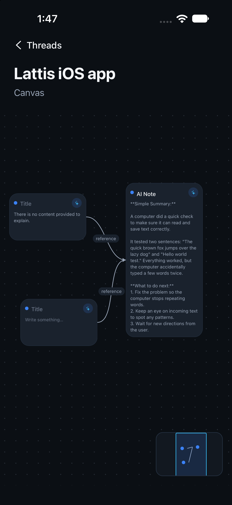

</div>

---

## Why Lattis?

Most note apps bury ideas in folders. Lattis gives every thought a **place on a canvas**, a **relationship to other thoughts**, and an **AI copilot** that can write, summarize, and explain without leaving the board.

| You get                            | How                                             |
| ---------------------------------- | ----------------------------------------------- |
| A second brain that stays in sync  | Firebase Auth + Firestore realtime listeners    |
| Instant research & drafting        | Gemini 2.5 Flash streaming into chat and notes  |
| Spatial thinking, not linear lists | Infinite canvas with pan, pinch, zoom & minimap |
| Explicit knowledge structure       | Directed edges with types & labels              |
| A polished iOS product feel        | Dark design system, 60 FPS gestures, safe areas |

---

## Features

- 🤖 **Streaming AI chat** — token-by-token Gemini 2.5 Flash replies with stop, regenerate, and markdown
- ♾️ **Infinite canvas** — pan, pinch-to-zoom, minimap, and a precise grid workspace
- 📝 **Draggable notes** — color-coded sticky notes that persist to Firestore in realtime
- 🔗 **Relationship engine** — Bézier edges with labels and types (`supports`, `depends`, `contradicts`, …)
- ✨ **AI note actions** — continue, summarize, rewrite, bullet points, explain — right on the note
- ☁️ **Realtime sync** — live listeners across projects, threads, notes, and edges
- 🔐 **Persistent authentication** — Firebase sessions restored securely on relaunch
- 🌙 **Native iOS UI** — dark-first design system, safe areas, and 44pt touch targets
- ⚡ **60 FPS interactions** — Reanimated worklets + Gesture Handler

---

## Screenshots

### Authentication

**Sign in** — clean email/password entry with password recovery and account creation.

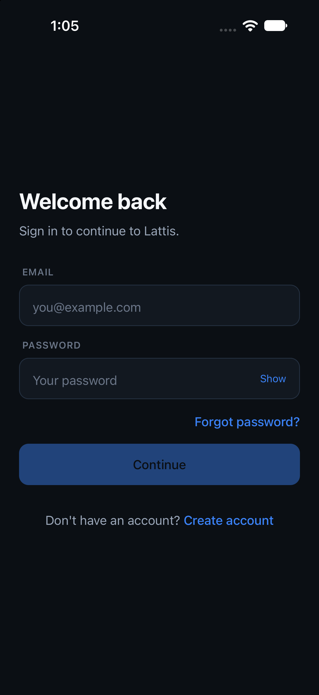

**Create account** — username uniqueness, date of birth, and live password strength before you join.

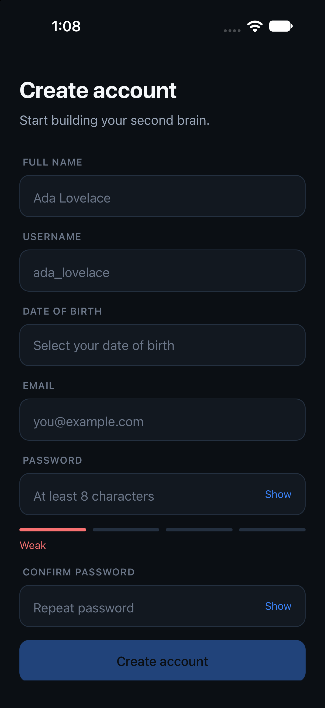

---

### Projects dashboard

Your home base: searchable project cards with emoji, accent color, and last-updated metadata.

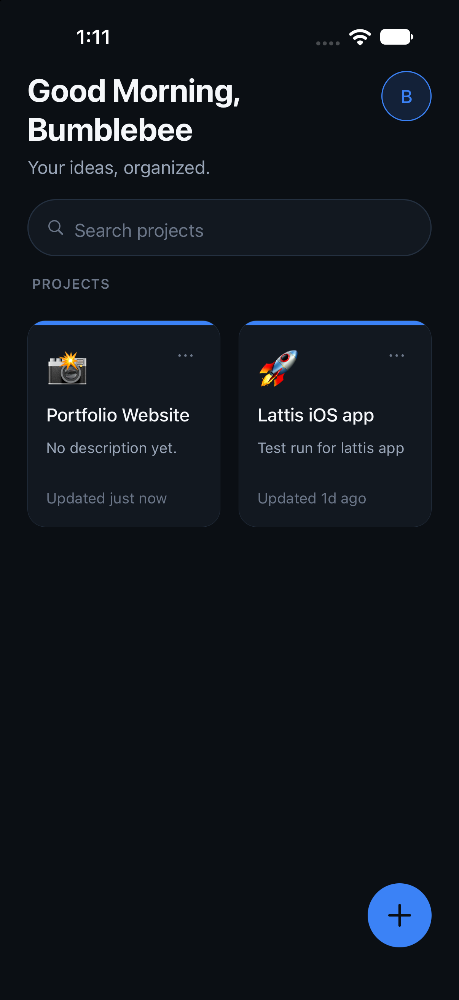

**Threads list** — every conversation lives under a project, with live previews and a path into the canvas.

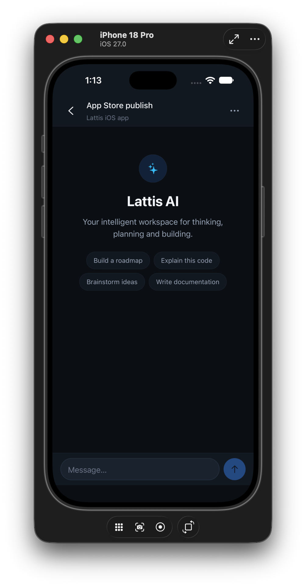

---

### AI chat

**Empty state** — guided prompts so a new thread never feels blank.

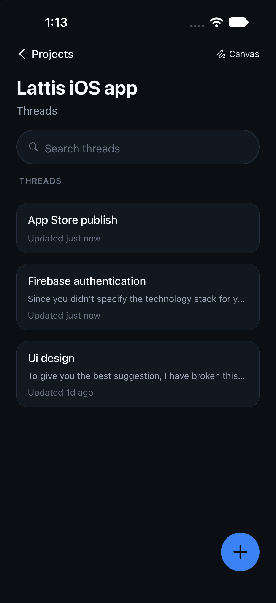

**Streaming reply** — long-form answers with markdown, headings, and copy/delete message actions.

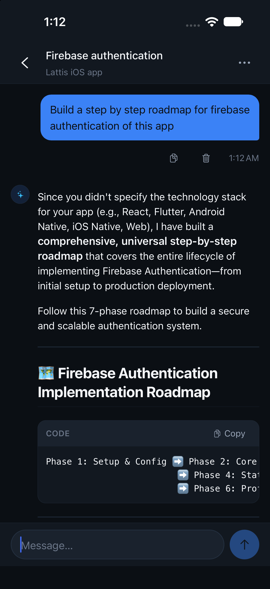

---

### Infinite canvas

**Full workspace** — sticky notes, AI-generated content, labeled edges, and a minimap for navigation.


**Relationship graph** — directed Bézier connections between notes (e.g. `reference`) so structure is visible, not hidden in folders.

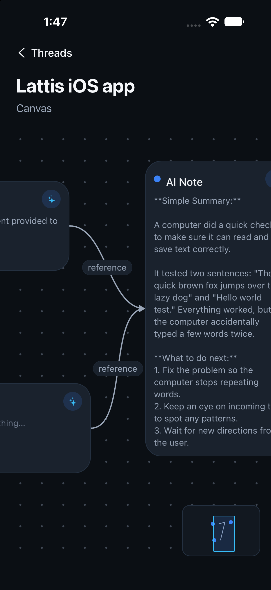

**AI actions on a note** — continue writing, summarize, rewrite, bullets, explain — plus **Delete note** when you need cleanup.

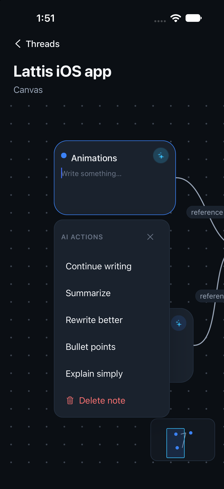

**Selected note toolbar** — sparkles + delete, with the connection handle ready to draw a new edge.

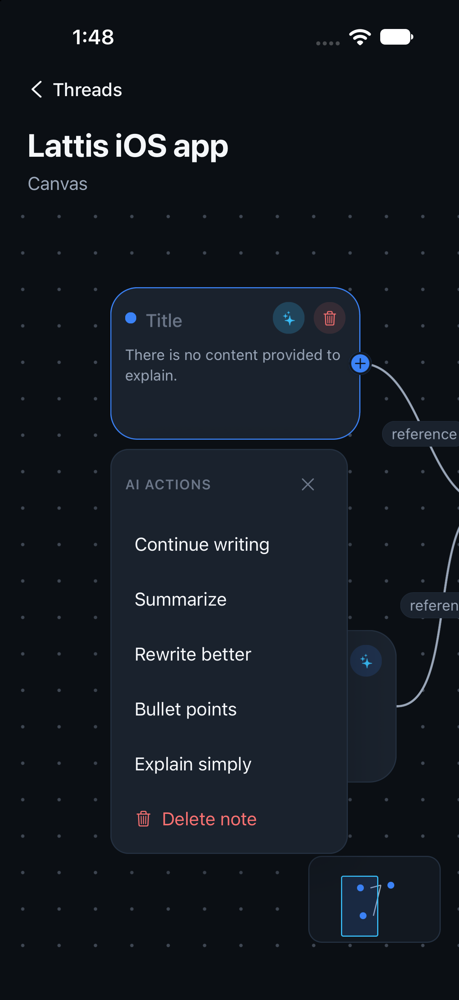

---

## Demo map

| Screen                 | What to look for                                              |
| ---------------------- | ------------------------------------------------------------- |
| **Projects dashboard** | Search, emoji cards, FAB to create                            |
| **AI chat**            | Streaming tokens, markdown, stop/regenerate                   |
| **Canvas**             | Double-tap to create, drag to move, pinch to zoom             |
| **Connections**        | Drag from the `+` handle, tap an edge to rename/retype/delete |
| **Note actions**       | Sparkle menu for AI transforms and delete                     |

---

## Architecture

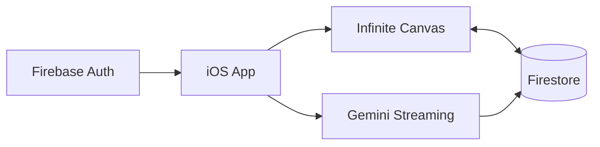

**Architecture highlights**

- Feature-first modules under `src/features/*`
- Realtime Firestore listeners for projects, threads, notes, and edges
- Streaming AI pipeline into chat **and** on-canvas AI notes
- Offline-friendly persistent auth (Firebase + SecureStore session snapshot)
- Shared design tokens in `src/theme`

---

## Tech stack

| Layer          | Technology                   |
| -------------- | ---------------------------- |
| Mobile         | React Native + Expo SDK 57   |
| Language       | TypeScript (Strict)          |
| Navigation     | Expo Router                  |
| Database       | Firebase Firestore           |
| Authentication | Firebase Authentication      |
| AI             | Gemini 2.5 Flash             |
| State          | Zustand                      |
| Animation      | Reanimated                   |
| Gestures       | React Native Gesture Handler |
| Graphics       | React Native SVG             |

---

## Project structure

```text
app/                          # Expo Router screens
 ├── (auth)/                  # Login, register, forgot-password
 ├── projects/
 │   ├── [projectId].tsx      # Project detail + thread list
 │   └── [projectId]/canvas.tsx
 └── threads/
     └── [threadId].tsx       # Streaming chat

src/
 ├── features/
 │   ├── auth/
 │   ├── chat/
 │   ├── canvas/
 │   ├── projects/
 │   └── threads/
 ├── services/
 │   ├── firebase/            # Auth + Firestore
 │   └── ai/                  # Gemini provider
 ├── components/
 ├── theme/
 └── store/
```

---

## Getting started

```bash
npm install

# Add Firebase + Gemini keys
cp .env.example .env

npm start
```

> **Required:** set `EXPO_PUBLIC_GEMINI_API_KEY` in `.env` (get a key from [Google AI Studio](https://aistudio.google.com/apikey)).  
> Also fill the `EXPO_PUBLIC_FIREBASE_*` values from your Firebase console so auth and realtime sync work.

Then press `i` for the iOS simulator, or run `npx expo run:ios` for a development build.

### Quality gates

```bash
npx tsc --noEmit        # typecheck
npx expo lint           # lint
npx prettier --check .  # format
```

---

## Roadmap

- [x] Authentication
- [x] AI Streaming Chat
- [x] Infinite Canvas
- [x] Relationship Engine
- [x] AI Notes
- [x] Persistent Sessions
- [ ] Voice Notes
- [ ] Multi-user Collaboration
- [ ] iPad Experience

---

## Security

This portfolio uses `EXPO_PUBLIC_GEMINI_API_KEY` client-side for demonstration purposes. Production deployments should proxy AI requests through a secure backend.

Firestore security rules enforce owner-only access and field-level validation on projects, threads, messages, and canvas nodes.

---

<div align="center">

Built by **Ishaan Parimal**

</div>
