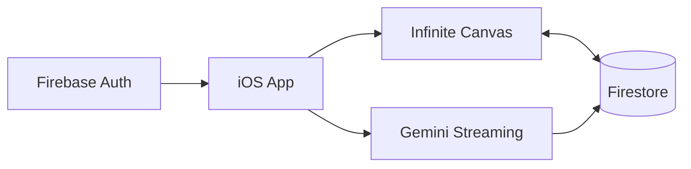

<div align="center">

# Lattis

> An AI-first visual thinking workspace for iOS built with React Native, Expo, Firebase & Gemini 2.5 Flash.

[](https://reactnative.dev/)
[](https://expo.dev/)
[](https://www.typescriptlang.org/)
[](https://firebase.google.com/)
[](https://ai.google.dev/)
[](https://developer.apple.com/ios/)

Lattis combines the experience of **Notion AI + FigJam + Apple Notes** into a realtime canvas where ideas become connected knowledge.

</div>

<!-- Hero screenshots — drop files at these paths to auto-render -->

<!--  -->
<!--  -->

## Features

- 🤖 **Streaming AI chat** — token-by-token Gemini 2.5 Flash replies with stop, regenerate, and markdown
- ♾️ **Infinite canvas** — pan, pinch-to-zoom, minimap, and a precise grid workspace
- 📝 **Draggable notes** — color-coded rich notes that persist to Firestore in realtime
- 🔗 **Relationship engine** — Bézier edges, labeled connections, and interactive edge menus
- ☁️ **Realtime sync** — live Firestore listeners across projects, threads, notes, and edges
- 🔐 **Persistent authentication** — Firebase Auth sessions restored securely on relaunch
- 🌙 **Native iOS UI** — dark-first design system, safe areas, and 44pt touch targets
- ⚡ **60 FPS animations** — Reanimated worklets + Gesture Handler for buttery interactions

## Demo

| AI Chat                                      | Canvas                                     |
| -------------------------------------------- | ------------------------------------------ |
| <!--  --> | <!--  --> |

| Connections                                          | Projects Dashboard                                                 |
| ---------------------------------------------------- | ------------------------------------------------------------------ |
| <!--  --> | <!--  --> |

## Architecture



**Architecture highlights**

- Feature-first modules under `src/features/*`
- Realtime Firestore listeners for projects, threads, notes, and edges
- Streaming AI response pipeline into chat and AI-generated notes
- Offline-friendly persistent auth via Firebase + SecureStore session snapshot
- Shared design token system in `src/theme`

## Tech Stack

| Layer          | Technology                   |
| -------------- | ---------------------------- |
| Mobile         | React Native + Expo SDK 57   |
| Language       | TypeScript (Strict)          |
| Navigation     | Expo Router                  |
| Database       | Firebase Firestore           |
| Authentication | Firebase Authentication      |
| AI             | Gemini 2.5 Flash             |
| State          | Zustand                      |
| Animation      | Reanimated 3                 |
| Gestures       | React Native Gesture Handler |
| Graphics       | React Native SVG             |

## Project Structure

```text
app/                          # Expo Router screens
 ├── (auth)/                  # Login, register, forgot-password
 ├── projects/
 │   ├── [projectId].tsx      # Project detail + thread list
 │   └── [projectId]/canvas.tsx
 └── threads/
     └── [threadId].tsx       # Streaming chat

src/
 ├── features/
 │   ├── auth/
 │   ├── chat/
 │   ├── canvas/
 │   ├── projects/
 │   └── threads/
 ├── services/
 │   ├── firebase/            # Auth + Firestore
 │   └── ai/                  # Gemini provider
 ├── components/
 ├── theme/
 └── store/
```

## Getting Started

```bash
npm install

# Add Firebase + Gemini keys
cp .env.example .env

npm start
```

> **Required:** set `EXPO_PUBLIC_GEMINI_API_KEY` in `.env` (get a key from [Google AI Studio](https://aistudio.google.com/apikey)).  
> Also fill the `EXPO_PUBLIC_FIREBASE_*` values from your Firebase console so auth and realtime sync work.

Then press `i` for the iOS simulator, or run `npx expo run:ios` for a development build.

## Roadmap

- [x] Authentication
- [x] AI Streaming Chat
- [x] Infinite Canvas
- [x] Relationship Engine
- [x] AI Notes
- [x] Persistent Sessions
- [ ] Voice Notes
- [ ] Multi-user Collaboration
- [ ] iPad Experience

## Security

This portfolio uses `EXPO_PUBLIC_GEMINI_API_KEY` client-side for demonstration purposes. Production deployments should proxy AI requests through a secure backend.

Firestore security rules enforce owner-only access and field-level validation on projects, threads, messages, and canvas nodes.

---

<div align="center">
  Built by <strong>Ishaan Parimal</strong>
</div>
